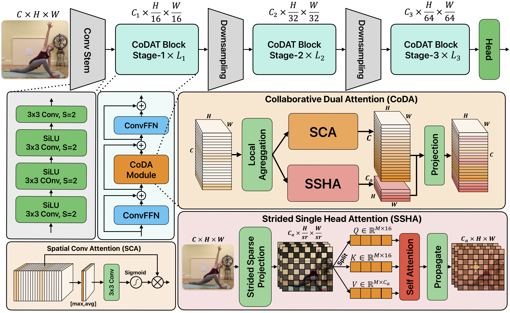

# CoDAT: Collaborative Dual-Attention Transformer with Low-Cost Temporal Modeling for Efficient Edge Action Recognition

Official PyTorch implementation of **CoDAT**, published in the *IEEE Internet of Things Journal*.

> **CoDAT: Collaborative Dual-Attention Transformer with Low-Cost Temporal Modeling for Efficient Edge Action Recognition**
> Novendra Setyawan, Chi-Chia Sun, Mao-Hsiu Hsu, Wen-Kai Kuo, Jing-Ming Guo, Jun-Wei Hsieh
> IEEE Internet of Things Journal, 2026. [[Paper]](https://doi.org/10.1109/JIOT.2026.3719793)

<p align="center">
  
</p>

## Highlights

- **CoDA (Collaborative Dual-Attention)** — a parallel dual-branch module combining:
  - **SSHA** (Strided Single-Head Attention): joint spatial (`N → N/sr²`) and channel (`C → C/4`) compression for global 2D attention at `O(N²·Cv/sr⁴)` complexity
  - **SCA** (Spatial Convolutional Attention): local saliency gating at `O(NC)`, fused with SSHA through a learned projection
- **Low-cost temporal modeling** — a single post-CoDA **TShift** (temporal shift) per block: zero learnable parameters, temporal receptive field `2L+1` frames covers the full clip
- **Edge-first evaluation** — real hardware-measured latency and energy on **Jetson AGX Orin** (INA3221 via `jtop`) and **Raspberry Pi 5** (MXL7704 PMIC ADC via `vcgencmd pmic_read_adc`)

## Results

### UCF-101 (8×256², single clip / single crop)

| Model | Pretrain | Param (M) | FLOPs (G) | Top-1 (%) | Latency (ms/F)* |
|---|---|---|---|---|---|
| TSM-MicroViT-S3 | IN-1K | 16.4 | 4.7 | 83.9 | 1.28 |
| TSM-EfficientViT-M5 | IN-1K | 12.2 | 4.3 | 86.1 | 1.56 |
| TSM-SHViT-S4 | IN-1K | 16.3 | 7.9 | 87.4 | 1.56 |
| **CoDAT-S** | IN-1K | **10.6** | **4.6** | **87.7** | **0.89** |
| **CoDAT-M** | IN-1K | 17.7 | 7.5 | **88.7** | 1.43 |
| TSM (ResNet-50) | K400 | 24.3 | 33.0 | 95.9 | 3.91 |
| TokShift | K400 | 85.9 | 135 | 95.4 | 10.15 |
| **CoDAT-S** | K400 | 10.6 | 4.6 | 94.2 | **0.89** |
| **CoDAT-M** | K400 | 17.7 | 7.5 | 95.2 | 1.43 |
| **CoDAT-S₃₈₄** | K400 | 10.6 | 10.3 | **95.4** | 1.60 |

\* Latency measured on Jetson AGX Orin with ONNX Runtime (CUDA EP), normalized per frame.

CoDAT-S₃₈₄ matches TokShift/LAPS accuracy at **~6× lower latency** and **~13× fewer FLOPs**. Kinetics-400, MA-52 and ImageNet-1K results are in the paper.

## Model Zoo

| Variant | Depth | Dims | Param (M) | FLOPs (G) @256² | TRF (frames) |
|---|---|---|---|---|---|
| CoDAT-S | [1, 2, 2] | — | 10.6 | 4.6 | 11 |
| CoDAT-M | [2, 4, 4] | — | 17.7 | 7.5 | 21 |
| CoDAT-L | [5, 5, 4] | — | — | — | 29 |

Pretrained weights will be released here upon publication.

## Installation

```bash
git clone https://github.com/novendrastywn/CoDAT.git
cd CoDAT
conda create -n codat python=3.10 -y
conda activate codat
pip install torch torchvision timm onnxruntime pandas openpyxl
```

For edge benchmarking:

```bash
# Jetson AGX Orin
pip install jtop onnxruntime-gpu

# Raspberry Pi 5
pip install onnxruntime psutil
# power measurement uses the onboard PMIC ADC — no extra hardware needed:
vcgencmd pmic_read_adc
```

## Usage

### Image classification (ImageNet-1K)

```python
from models import codat_s

model = codat_s(num_classes=1000, pretrained=True)
```

### Video action recognition

Video input `[B, T, C, H, W]` is reshaped to `[B·T, C, H, W]` (standard TSM protocol). A single TShift is inserted before the final ConvFFN of each CoDA block (post-CoDA placement):

```python
from models import codat_action_s

model = codat_action_s(
    num_classes=101,   # UCF-101
    n_segment=8,       # input frames
    shift_div=8,       # 1/8 of channels shifted
    pretrained='path/to/imagenet_or_k400_weights.pth',
)
# input: (B*T, 3, 256, 256) -> logits: (B, num_classes)
```

### TSM lightweight baselines

The TSM-augmented baselines used in Table VII are included for reproducibility:

```python
from baselines import tsm_shvit_s3, tsm_shvit_s4, tsm_efficientvit_m5, tsm_microvit_3, tsm_fastvit_s12
```

## Edge Benchmarking

All latency/energy figures in the paper are reproducible with the scripts in `benchmark/`:

```bash
# Jetson AGX Orin — INA3221 hardware power via jtop, 115 reps × 3 runs
python benchmark/bench_jetson.py --runs 3 --repetition 115

# Raspberry Pi 5 — PMIC ADC hardware power, two-pass protocol, 50 reps × 2 runs
python benchmark/bench_rpi5.py --runs 2 --repetition 50 --power-method pmic_adc

# Raspberry Pi 5 — image classification backbones (throughput + latency)
python benchmark/bench_rpi5_cls.py --thr-runs 1 --lat-runs 2
```

Measurement protocol (details in Section IV-A of the paper and the supplementary material):

- 10 s warm-up per model; run 0 discarded; cooldown between models (30 s Jetson / 60 s RPi5)
- **RPi5 two-pass design**: power is sampled during a dedicated 20 s inference pass (the `pmic_read_adc` subprocess costs ~200 ms per call), then latency is timed with **no background threads**, so power sampling never contaminates timing
- Energy per frame: `E = P̄ × T_clip / N_frames` (mJ/F); all latency normalized per frame (ms/F)
- Multi-view (3 crops × 10 clips) is used only for accuracy; latency/energy always single-clip single-crop

## Repository Structure

```
CoDAT/
├── models/              # CoDAT backbone + action recognition variants
├── baselines/           # TSM-SHViT, TSM-EfficientViT, TSM-MicroViT, TSM-FastViT
├── benchmark/
│   ├── bench_jetson.py      # Jetson AGX Orin (jtop / INA3221)
│   ├── bench_rpi5.py        # Raspberry Pi 5 action recognition (PMIC ADC, two-pass)
│   └── bench_rpi5_cls.py    # Raspberry Pi 5 classification backbones
├── onnx_action/         # exported ONNX models (action recognition)
├── onnx_lat/            # exported ONNX models (classification)
└── assets/
```

## Citation

```bibtex
@article{setyawan2026codat,
  title   = {CoDAT: Collaborative Dual-Attention Transformer with Low-Cost
             Temporal Modeling for Efficient Edge Action Recognition},
  author  = {Setyawan, Novendra and Sun, Chi-Chia and Hsu, Mao-Hsiu and
             Kuo, Wen-Kai and Guo, Jing-Ming and Hsieh, Jun-Wei},
  journal = {IEEE Internet of Things Journal},
  year    = {2026},
  doi     = {10.1109/JIOT.2026.3719793}
}
```

## Acknowledgements

This work was supported by the National Science and Technology Council, Taiwan, under Grant NSTC-113-2221-E-305-018-MY3. The implementation builds upon [TSM](https://github.com/mit-han-lab/temporal-shift-module), [SHViT](https://github.com/ysj9909/SHViT), [EfficientViT](https://github.com/microsoft/Cream/tree/main/EfficientViT), and [timm](https://github.com/huggingface/pytorch-image-models).

## License

Released under the MIT License. See [LICENSE](LICENSE) for details.
